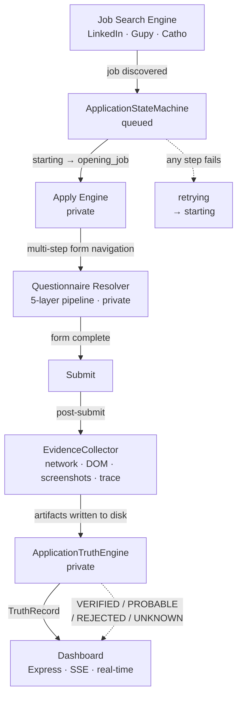

# VRAXIA WORK

Autonomous job application system built on TypeScript and Playwright. Navigates
multi-step application forms across LinkedIn, Gupy, and Catho; resolves
questionnaire answers through a 5-layer pipeline; captures multi-source evidence
per application; and independently verifies every submission.

[](https://www.typescriptlang.org/)
[](https://nodejs.org)
[](https://playwright.dev)
[](https://anthropic.com)
[](./LICENSE)

---

## Overview

VRAXIA WORK is an autonomous agent that runs a complete job application workflow:
discovers openings, scores fit, navigates the application form, answers
job-specific questions, and produces an independently verified record of every
submission attempt.

**Current status:** Operational. Used to process 529+ job listings and submit 82
applications across three platforms. Implementation details are withheld for IP
reasons; public interfaces, architecture decision records, and observability
tooling are available in this repository.

---

## Problem

Applying to a sufficient volume of jobs in Brazil requires submitting dozens of
applications per week while maintaining quality on each one: adapted CV, correctly
answered questionnaires, and verifiable proof of submission.

The core engineering challenge is not the automation itself — it is verification.
Browser automation can navigate to a confirmation page and register success while
the HTTP submit request failed silently: expired session, network interruption
without exception, redirect to a generic page that looks like confirmation but
isn't. A system that believes it applied when it did not is operationally worse
than one that fails loudly.

---

## Architecture



The system is structured in four layers:

**1 — Orchestration.** `ApplicationStateMachine` enforces lifecycle transitions.
No component can advance an application without going through the machine. Invalid
transitions throw immediately; they never silently corrupt state.

**2 — Execution.** The apply engine (private) handles form navigation, file
uploads, modal interactions, and anti-detection. It is invoked by
`ApplicationService`, which wires all components together.

**3 — Evidence.** `EvidenceCollector` captures network requests, DOM snapshots,
and screenshots independently of the apply engine. It writes to the evidence
directory; it does not read from or influence workflow state.

**4 — Verification.** `ApplicationTruthEngine` (private) acts as a read-only
external auditor. It reads physical artifacts from the evidence directory after
workflow completion and produces a `TruthRecord` — a verdict that is independent
of what the workflow believes happened.

---

## Engineering Decisions

### Why a finite state machine?

Without explicit state management, autonomous multi-step processes accumulate
implicit assumptions about where they are in the workflow. When something fails,
the question "what was the system doing?" has no reliable answer.

A finite state machine makes illegal states unrepresentable at the type level.
If the machine does not know about a transition, that transition does not happen.
Every state change is recorded in the history log with timestamps and duration,
making the system fully reconstructable post-failure.

→ See [ADR-003: Application State Machine](docs/ADR-003-state-machine.md)

### Why an independent Truth Engine?

Workflow state (`ApplicationState`) and verification state (`TruthStatus`) must
not be conflated. An application can reach `confirmed` while the submit request
failed. The Truth Engine reads physical evidence from disk — network captures,
DOM snapshots, trace files — rather than trusting in-memory workflow state.

This separation has three consequences:
1. Any historical application can be re-audited from its evidence directory.
2. A bug in the apply engine cannot influence the truth verdict.
3. Dashboard metrics have two independent columns: workflow outcome and evidence verdict.

→ See [ADR-002: Truth Engine — Evidence-Based Verification](docs/ADR-002-truth-engine.md)

### Why separate evidence capture from verification?

`EvidenceCollector` writes. `ApplicationTruthEngine` reads. They share only the
evidence directory on disk. This means the Truth Engine can be run post-hoc on
any past application, independently of whether the apply engine is running.

### Why explicit retry states?

`failed → retrying → starting` is a first-class path in the state machine, not
implicit behavior. This makes retry observable: you can query how many
applications are currently in `retrying`, what their last failure reason was, and
how many retry attempts they have consumed. Retry caps are enforced by the state
machine, not by a counter buried in a catch block.

### Cost governance

Every LLM call is routed by task complexity before the call is made. Claude Haiku
for questionnaire classification (~80 tokens/call). Claude Sonnet for form
context reasoning. Prompt caching is enabled on all system prompts. Token caps
are architectural constraints defined in configuration, not per-call decisions.

→ See [ADR-001: Architecture](docs/ADR-001-architecture.md)

---

## Technology

| Layer | Technology |
|---|---|
| Runtime | TypeScript 5.4 · Node.js 20+ · ESM |
| Browser automation | Playwright 1.44 |
| LLM | Anthropic Claude (Haiku · Sonnet) |
| Local RAG | TF-IDF over JSONL (no embedding API calls) |
| Persistence | SQLite (SQL.js) · JSONL logs |
| API | Express 5 |
| Dashboard | HTML5 · SSE · Chart.js |
| Testing | Vitest 2 |

---

## Project Structure

```
docs/
  ADR-001-architecture.md        Architecture rationale and decisions
  ADR-002-truth-engine.md        Evidence-based verification design
  ADR-003-state-machine.md       FSM design with full state diagram
packages/work/
  src/
    application/                 State machine · types · evidence interfaces
    agents/                      QuestionnaireLogger · MatchAgent · StatusTracker
    cli/                         Entrypoints: hunt · apply · diagnostics
    engine/                      Job search · session management · modality detection
    rag/                         Vault loader · TF-IDF retriever
    scheduler/                   Anti-detection · execution windows · history
  dashboard/                     Real-time monitoring SPA
  docs/
    Architecture.md              Component-level architecture
    Observability.md             Evidence structure and Truth Engine output
    Runbook.md                   Operational guide
    screenshots/                 Dashboard screenshots from production runs
```

---

## Observability

Every application run produces a structured evidence directory:

```
.vraxia-work/logs/application_{jobId}/
├── manifest.json      metadata: company, platform, duration, final state
├── network.json       all captured requests (URL, method, status, body)
├── trace.json         robot events (step, action, durationMs, result)
├── timeline.json      state transition history
├── health-report.json browser health score post-application
├── truth-record.json  TruthRecord: verdict, score, evidence summary
└── screenshot_*.png   visual evidence (upload, submit, confirmation)
```

Real-time dashboard provides:
- Application funnel (scanned → scored → applied → verified)
- Per-application state and truth status columns
- Error classification with 15 categories and per-category retry policy
- Questionnaire log: question, resolution layer, context used

---

## Dashboard Screenshots

**Overview and application table**


**Truth Engine — workflow vs. evidence columns**


**Questionnaire log — resolution source per answer**


**Analytics — application funnel and platform breakdown**


---

## Security and IP

The implementation of the apply engine, questionnaire resolver, truth engine,
validation engine, and transition topology is withheld. What is publicly
available:

- All TypeScript types and interfaces (`src/application/types.ts`)
- `ApplicationStateMachine` public interface
- `ApplicationService` orchestration wiring
- `EvidenceCollector` and `ApplicationTracer` interfaces
- Architecture Decision Records (ADR-001, ADR-002, ADR-003)
- Observability infrastructure and dashboard

See [LICENSE](LICENSE) for full terms.

---

## Current Status

Personal-scale operational system. Not a SaaS product. No external users.

---

## Future Work

- [ ] Parallel application execution across platforms
- [ ] Formal integration test suite for the questionnaire resolver
- [ ] Richer truth evidence from ATS confirmation APIs
- [ ] Post-apply status tracking integration (LinkedIn, Gupy notifications)

---

## Architecture Decision Records

| ADR | Topic |
|---|---|
| [ADR-001](docs/ADR-001-architecture.md) | System architecture and technology choices |
| [ADR-002](docs/ADR-002-truth-engine.md) | Evidence-based application verification |
| [ADR-003](docs/ADR-003-state-machine.md) | Finite state machine design |

---

## License

Copyright © 2026 Samir Ricardo de Oliveira Almeida. All Rights Reserved.

This repository is provided for technical evaluation and portfolio review.
See [LICENSE](LICENSE) for full terms.

---

## Author

[Samir Ricardo](https://github.com/SAMIRRICARDO) ·
[LinkedIn](https://linkedin.com/in/samir-ricardo-almeida-b23b3825b) ·
[contato@vrashows.com.br](mailto:contato@vrashows.com.br)
