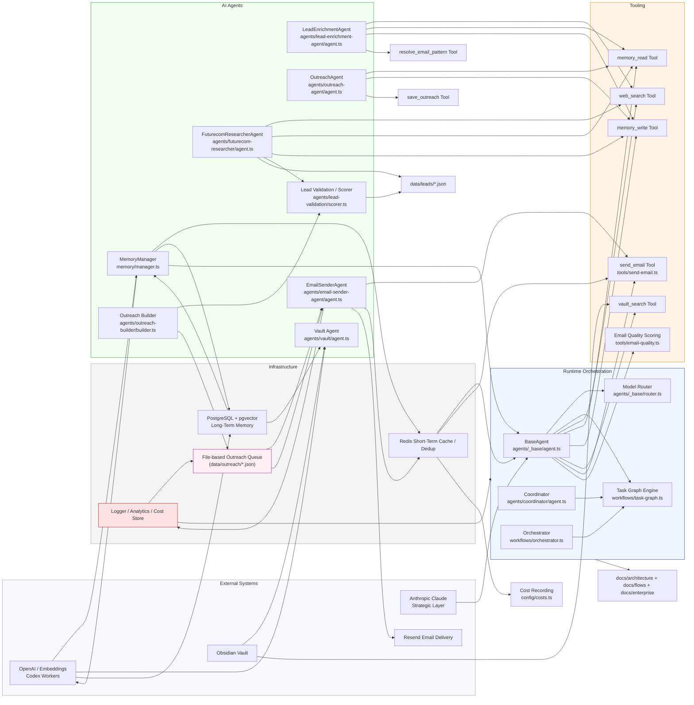

# VRASHOWS AI Runtime Architecture

## Visão geral

O runtime AI da VRASHOWS é um sistema modular de agentes, orquestração e memória concebido para gerar, validar e executar outreach empresarial com foco em eventos como Futurecom 2026. A arquitetura integra:

- **Claude strategic layer** para raciocínio agente-driven e orquestração de tarefas.
- **Codex/OpenAI workers** para embeddings, memória semântica e indexação de vault.
- **Redis** como memória de curto prazo, cache e deduplicação.
- **PostgreSQL + pgvector** como memória de longo prazo para RAG e recuperação semântica.
- **Resend** para entrega de email transacional.
- **Queue file-based pipeline** para validação de leads, criação de filas de outreach e disparo controlado.

## Diagrama de arquitetura

## Responsabilidades dos módulos

### `agents/_base/agent.ts`
- `BaseAgent` implementa o loop agente-tool, comprime contexto e registra custo.
- Fornece `memoryEnabled` e `memorySaveEnabled` para seleção dinâmica de memória.
- Suporta ferramenta e ciclo de `tool_use` do Anthropic.

### `agents/_base/router.ts`
- Roteia para `Models.fast` em cheap mode.
- Decide entre modelos de alto ou baixo custo com base no prompt.
- Permite fallback por heurística e classificação.

### `config/models.ts`
- Define limites de token e iterações para `default`, `fast` e `cheap`.
- Garante que `CHEAP_MODE` reduza consumo de tokens e loops.

### `memory/short-term/redis.ts`
- Fornece cache resiliente, deduplicação de e-mail e armazenamento de estado de sessão curto.
- Degrada graciosamente quando Redis não está disponível.

### `memory/manager.ts`
- Gerencia memória semântica em PostgreSQL/pgvector.
- Cria embeddings com OpenAI, mantém índices e retorna contexto relevante para agentes.

### `memory/long-term/vault-index.ts`
- Indexa a Obsidian Vault em chunks semânticos.
- Suporta pesquisa híbrida para conhecimento de domínio e reposição de contexto.

### `agents/futurecom-researcher/agent.ts`
- Identifica empresas relevantes para Futurecom e eventos corporativos.
- Usa tools de pesquisa e grava leads estruturados via `save_lead`.

### `agents/lead-enrichment-agent/agent.ts`
- Gera contatos de decisão, cargos e emails prováveis a partir de empresas.
- Usa `resolve_email_pattern` para inferir endereços corporativos.

### `agents/outreach-agent/agent.ts`
- Produz pacotes de outreach consultivo: email + LinkedIn + posicionamento estratégico.
- Usa memória para evitar duplicação e reuso de outreach.

### `agents/email-sender-agent/agent.ts`
- Executa envio de e-mails via Resend.
- Usa política de deduplicação, rate limiting e BCC configurável.

### `agents/lead-validation/scorer.ts`
- Converte leads brutos em `ValidatedLead` com scores, risco de bounce e prioridade.
- Classifica leads como `HOT`, `WARM`, `LOW_PRIORITY` ou `INVALID`.

### `agents/outreach-builder/builder.ts`
- Gera e-mails determinísticos de alta qualidade, sem LLM.
- Anexa bloco de posicionamento VRASHOWS e CTA personalizado.

### `scripts/generate-outreach-queue.ts`
- Transforma leads validados em uma fila de outreach acionável.
- Grava `data/outreach/*.json` com status, qualidade e priorização.

### `scripts/run-outbound-batch.ts`
- Executa envio controlado de campanhas com limitação de taxa e filtro de qualidade.
- Prioriza `HOT` antes de `WARM` e gera relatórios JSON em `logs/outreach`.

### `tools/send-email.ts`
- Aplica template HTML VRASHOWS, anexa PDF institucional e garante envio seguro.
- Registra dedup via Redis e suporta modo dry-run.

## Fluxo operacional completo

1. **Aquisição de leads**
   - `FuturecomResearcherAgent` pesquisa empresas e salva `LeadProfile`.
   - Alternativa determinística: `agents/lead-sourcing/sourcer.ts` converte seed data sem LLM.

2. **Validação e score**
   - `scripts/validate-leads.ts` ou `generate-outreach-queue.ts` usa `agents/lead-validation/scorer.ts`.
   - Cada lead recebe `relevanceScore`, `strategicFitScore`, `bounceRisk`, `outreachPriority` e `status`.

3. **Enriquecimento de contatos**
   - `LeadEnrichmentAgent` adiciona decision makers, LinkedIn e emails inferidos.
   - Deduplicação e memória de contexto reduzem repetição.

4. **Construção de outreach**
   - `agents/outreach-builder/builder.ts` monta email subject/body/html.
   - `generate-outreach-queue.ts` produz a fila `data/outreach/*.json` com qualidade e prioridade.

5. **Entrega de email**
   - `scripts/run-outbound-batch.ts` lê a fila, aplica filtros e executa `sendEmail(...)`.
   - `send-email.ts` anexa mídia kit PDF e envia via Resend.

6. **Memória e análise**
   - Memória curta: Redis para deduplicação, cache de respostas e de embeddings.
   - Memória longa: PostgreSQL + pgvector para RAG e contexto histórico.
   - Cost tracking em Redis via `config/costs.ts` para auditoria de custo por agente.

## Pontos de escalabilidade

- **Orquestração paralela**: `workflows/coordinator.ts` usa `p-limit` com concurrency default 4.
- **Cache de resposta**: `agents/_base/cache.ts` e Redis reduzem chamadas redundantes.
- **Embeddings em paralelo**: `vault-index.ts` usa concurrency 8 para indexação.
- **Rate limiting**: `tools/send-email.ts` aplica delay padrão 1200ms.
- **Queue-based batch execution**: `scripts/run-outbound-batch.ts` permite throttle manual e reexecução.

## Gargalos potenciais

- **Envio de email suplantando Resend**: o batch é sequencial e depende do delay; alta escala exige worker pool ou broker.
- **Embutimento de contexto**: prompts longos podem exceder limites; o sistema compõe compressão, mas ainda pode ser limitado.
- **Memória semântica baseada em Postgres**: escalar pgvector exige tuning e shards para grandes vaults.
- **Arquivo-based queue**: não é um broker real; é ótimo para pipelines batch, mas pior para alta concorrência.
- **Dependência de Redis**: embora degrade graciosamente, perda do Redis reduz deduplicação, cache e análise de custo.

## Otimizações recomendadas

- Convertendo fila de arquivo para broker real (Redis Stream, RabbitMQ, SQS).
- Externalizar envio de email para workers assíncronos com controle de backpressure.
- Adotar métricas de observabilidade real (`Prometheus`, `Grafana`) em vez de JSON estático.
- Segmentar `MemoryManager` em subsistemas de leitura/gravação e clusterizar o banco de embeddings.
- Expandir `cheap mode` para incluir `DEV_MODE=false` com `models.fast`+`maxIterations` reduzidas.
- Aumentar a maturidade de `coordenação de tarefas` com mais workflows pré-definidos e retry.

## Cheap mode e roteamento de custo

- `config/env.ts` ativa `isCheapMode` com `CHEAP_MODE=true` ou `DEV_MODE=true`.
- `config/models.ts` limita tokens a `2048` e iterações no máximo `5`.
- `agents/_base/router.ts` força o uso de `Models.fast` e reduz tier de modelo.
- Essa camada garante que a plataforma degrade para um modo de execução econômica, preservando estabilidade.

## Futuro da produção

- **Escalabilidade de agentes**: transformar `scripts/run-*` em microserviços ou jobs agendados.
- **Orquestração resiliente**: migrar `TaskGraph` para engine de workflow com persistência de estado.
- **Filas e workers**: usar Redis Streams / SQS para dispatch de `OutreachQueueEntry` e workers de envio.
- **Observabilidade**: adicionar traces de custo e latência em `logs/outreach` e por agente.
- **Governança**: documentar SLAs de email, taxas de rejeição e limites de custo.
- **Segurança**: mover `RESEND_API_KEY`, `DATABASE_URL` e `REDIS_URL` para vault e rotacionar credenciais.
