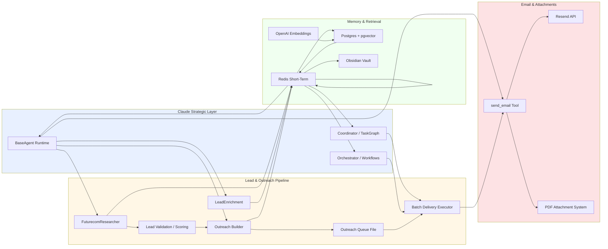

# VRASHOWS AI Runtime — Enterprise Documentation

## Executive summary

O runtime AI da VRASHOWS é uma plataforma de geração de leads e outreach empresarial construída em três camadas:

- **Strategic inference**: Anthropic Claude como camada de tomada de decisão e orquestração
- **Memory & retrieval**: Redis para cache de curto prazo e PostgreSQL/pgvector para memória semântica de longo prazo
- **Delivery pipeline**: validação de leads, geração de outreach e envio via Resend

A arquitetura foi projetada para ser auditável, modular e preparada para migração a um ambiente de produção escalável.

## Arquitetura empresarial — visão consolidada

### Componentes principais

- **Claude strategic layer**
  - `agents/_base/agent.ts`
  - `agents/_base/router.ts`
  - `agents/coordinator/agent.ts`
  - `workflows/task-graph.ts`
- **Codex / OpenAI workers**
  - `memory/manager.ts`
  - `memory/long-term/vault-index.ts`
  - embeddings e RAG
- **Memory e cache**
  - `memory/short-term/redis.ts`
  - `tools/memory-tool.ts`
  - `config/costs.ts`
- **Outreach pipeline**
  - `agents/lead-validation/scorer.ts`
  - `agents/outreach-builder/builder.ts`
  - `scripts/generate-outreach-queue.ts`
  - `scripts/run-outbound-batch.ts`
- **Email delivery**
  - `agents/email-sender-agent/agent.ts`
  - `tools/send-email.ts`
  - `Resend API`

### Diagrama de alto nível

## Responsabilidades organizacionais

### Strategic AI layer

- Mantém controle de fluxo e política de custo.
- Decorre de `agents/_base/agent.ts` e `agents/_base/router.ts`.
- Permite que todas as decisões de rede e tool-use sejam auditadas.

### Lead acquisition e validação

- `FuturecomResearcherAgent` traz empresas alinhadas a Futurecom.
- `Lead Validation Scorer` adiciona governança de qualidade e risco.
- `generate-outreach-queue.ts` formaliza a fila de envio em JSON.

### Enriquecimento e outreach

- `LeadEnrichmentAgent` garante perfis de decisão e cobertura de contatos.
- `OutreachBuilder` produz conteúdos padronizados e rastreáveis.
- `OutreachAgent` pode ser usado para geração LLM-driven quando necessário.

### Email delivery e compliance

- `EmailSenderAgent` isola a entrega de mensagem do conteúdo.
- `tools/send-email.ts` aplica template, arquivos anexos e deduplicação.
- `run-outbound-batch.ts` garante envio ordenado, limite de taxa e relatórios.

### Memorization & RAG

- Redis armazena:
  - cache de resposta
  - chaves de dedup de email
  - custo acumulado
  - embeddings em cache
- PostgreSQL + pgvector armazena:
  - memórias semânticas
  - chunks de vault
  - contexto histórico para agentes

## Pontos de escalabilidade críticos

- **Orquestração de tarefas**: `Coordinator` + `TaskGraph` permitem paralelismo controlado.
- **Cache e dedup**: Redis como camada de alto desempenho para reduzir chamadas repetidas.
- **Memory retrieval**: RAG em Postgres é a base para escalabilidade do conhecimento.
- **Delivery pipeline**: separado em fila JSON e executor batch para evitar sobrecarga em Resend.

## Riscos e gargalos

- **Envio sequencial**: `run-outbound-batch.ts` é o maior limitador em alta escala.
- **Dependência de Resend**: qualquer falha de provedor desacelera toda campanha.
- **Memória semântica**: aumento de massa de dados exige tuning de índice ivfflat e hardware.
- **Arquivo-based queue**: boa para pipelines auditáveis, mas limitada para orquestração multi-worker.

## Otimizações empresariais recomendadas

- Implementar **brokers reais** para filas: Redis Streams / SQS / Kafka.
- Adotar **workers assíncronos de email** com backpressure e retry.
- Converter `data/outreach/*.json` em **persistence store** ou fila de missão crítica.
- Registrar métricas em **Observability Stack** (Prometheus, Grafana, OpenTelemetry).
- Replicar Redis e Postgres para alta disponibilidade.
- Introduzir **governança de custo**: orçamento por agente e alertas de consumo.

## Cheap mode e custo controlado

- `CHEAP_MODE=true` reduz tokens, iterações e roteia para `Models.fast`.
- `DEV_MODE=true` ativa o mesmo comportamento econômico para testes.
- Esta camada assegura que uma configuração de baixo custo ainda execute pipelines funcionais.

## Produção futura

### Recomendação 1: microserviços de pipeline

Separar os componentes em unidades discretas:

- lead ingestion service
- validation service
- enrichment service
- queue generator
- email worker pool
- memory retrieval service

### Recomendação 2: orquestração resiliente

- Adotar um workflow engine com persistência de estado e retry.
- Não depender apenas de `scripts/*.ts` para produção.

### Recomendação 3: segurança e compliance

- Usar vault para chaves (`RESEND_API_KEY`, `DATABASE_URL`, `REDIS_URL`).
- Monitorar as taxas de rejeição e feedback de entrega.

### Recomendação 4: métricas e governança

- Medir:
  - leads processados por ciclo
  - taxa HOT/WARM
  - custo por agente
  - latência de memória RAG
  - taxa de entregas e falhas de email

## Conclusão

A arquitetura atual já é robusta para um ambiente enterprise de prova de conceito. A evolução para produção deve priorizar filas reais, workers assíncronos, observabilidade e governança de custo.
