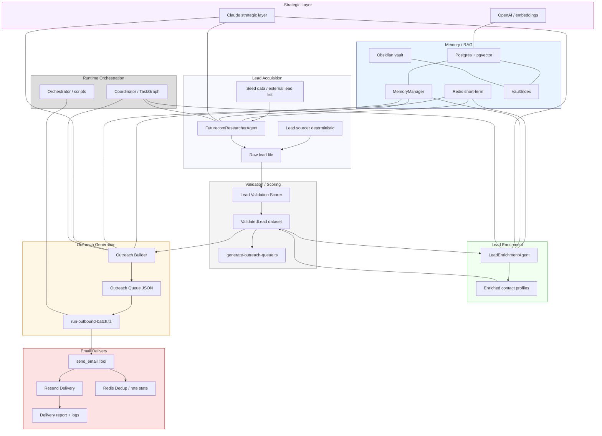

# VRASHOWS AI Runtime Flows

## Visão geral dos fluxos

Este documento descreve o fluxo de dados e operações do runtime AI VRASHOWS em cinco etapas principais:

1. Futurecom lead acquisition flow
2. Lead enrichment pipeline
3. Validation/scoring pipeline
4. Outreach generation
5. Email delivery

Também cobre memória, logging, custo, filas e cheap mode.

## Diagrama de fluxo

## Fluxos principais

### 1. Futurecom lead acquisition flow

- `scripts/run-outreach.ts` ou `FuturecomResearcherAgent` identifica empresas relevantes para eventos.
- O agente chama `web_search` e usa `save_lead` para persistir `LeadProfile` em memória de execução.
- O resultado é exportado como JSON bruto e serve de insumo para a validação.

### 2. Lead enrichment pipeline

- `LeadEnrichmentAgent` coleta perfis de decisão e inferências de e-mail.
- Usa `memory_read`/`memory_write` para evitar duplicações entre execuções.
- Inclui `resolve_email_pattern` para gerar variantes de e-mail sem depender apenas do LLM.

### 3. Validation/scoring pipeline

- `agents/lead-validation/scorer.ts` converte raw leads em `ValidatedLead`.
- Calcula `relevanceScore`, `strategicFitScore`, `bounceRisk` e `outreachPriority`.
- Classifica leads em `HOT`, `WARM`, `LOW_PRIORITY` ou `INVALID`.
- A partir daí, `generate-outreach-queue.ts` produz a fila JSON de envio ordenada.

### 4. Outreach generation

- `agents/outreach-builder/builder.ts` monta subject, bodyText e bodyHtml.
- O builder aplica posicionamento VRASHOWS e blocos de CTA, personalização e mensagem de anexo.
- A fila resultante inclui qualidade de email e prioridade por lead.

### 5. Email delivery

- `scripts/run-outbound-batch.ts` executa envio em modo dry-run ou live.
- Ordena `HOT` antes de `WARM`, aplica `--limit` e `--min-quality`.
- Chama `tools/send-email.ts`, que aplica template HTML e anexos.
- Deduplicação e taxa de envio são controladas em Redis.

## Logging e análise

- Logs e relatórios JSON são salvos em `logs/outreach`.
- `config/costs.ts` registra custos por agente em Redis.
- `logger` é usado por agentes e ferramentas para rastrear eventos, erros, deliverability e gastos.

## Queue / throttling strategy

- A fila de outreach é um arquivo JSON em `data/outreach/*.json`.
- `run-outbound-batch.ts` faz throttle com `--rate-delay`, `--limit` e priorização HOT/WARM.
- Esta abordagem é batch-first, confiável para campanhas controladas, mas não é um broker de alta escala.
- Para produção futura, recomenda-se migrar para um broker real (Redis Streams, SQS, Kafka).

## Cheap mode routing

- `config/env.ts` define `CHEAP_MODE` e `DEV_MODE`.
- Em cheap mode, `config/models.ts` reduz `maxTokens` para 2048 e `maxIterations` para 5.
- `agents/_base/router.ts` roteia diretamente para `Models.fast`.
- O objetivo é minimizar custo mantendo respostas funcionais.

## Insights de escala e otimização

- O pipeline é modular e permite expansão em workers separados.
- O gargalo atual mais crítico é o envio sequencial do `run-outbound-batch.ts` e a dependência de Resend.
- A memória longa é dimensionável, mas depende de PostgreSQL/pgvector.
- A arquitetura aceita facilmente shards de memória, cache hierárquico e paralelismo de workflow.
